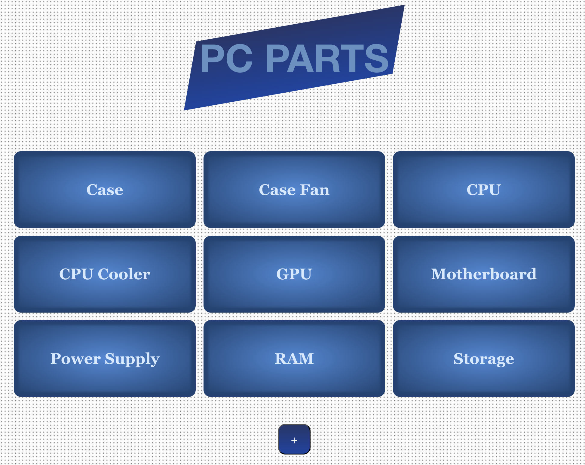

# Inventory Application

A PC parts inventory management application that allows users to view available parts and add new categories or parts. Only users with the admin password can update or delete existing entries.

The application is built entirely on the server side using EJS for rendering and follows the MVC design pattern. It leverages Express.js as the web framework, PostgreSQL for data storage, express-validator for validating user input, and express-session for session management and authentication.

#### You can check out the app using the link in the sidebar or by clicking [here](https://inventory-application-xpsx.onrender.com/)!